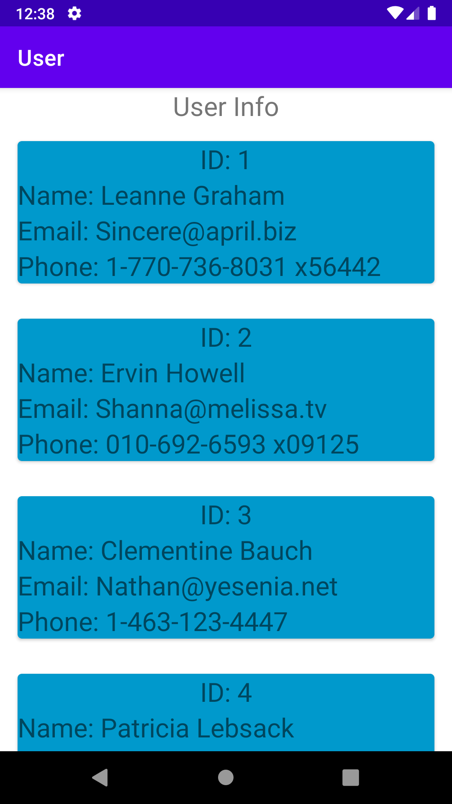
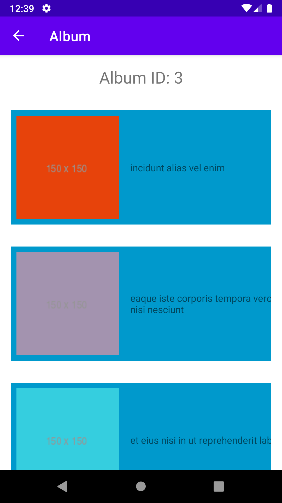
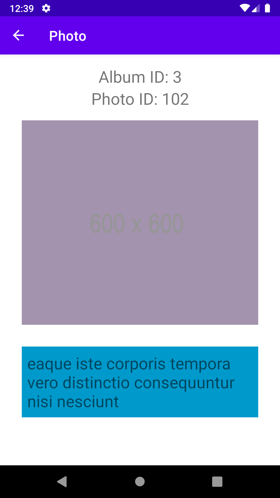

# Sample test

##### Android App development

#### 1. Write a sample app to display user info list in the first screen(Screen-1) for all

#### the users provided by service -> https://jsonplaceholder.typicode.com/users

- Display only Name, Email and Phone number
- Page title should be displayed as “User Info”
- User info tile should be blue background with info text displayed as white color. As

###### shown in the sample screen.

#### 2. On clicking user info tile, next screen(Screen-2) should be displayed list of

#### pictures where album id == user id. Album information is provided by service ->

#### https://jsonplaceholder.typicode.com/photos

- Above service provides several albums with few images in each album
- While listing album you must use thumbnail image urlprovided through “thumbnailUrl”.

#### 3. Clicking an image from thumbnail list should display actual picture on the

#### screen (Screen-3) with image title displayed at the bottom of the screen.

- To display actual image you must use URL provided under field “url”.
- Image title should be displayed in white text inside a tile with blue background as shown

###### in the sample screen.

## Screen Transition

<!--  -->
    

### Rules to be followed while writing sample app:

- You are allowed to use use third party library for network services only.
- You should be able to showcase your knowledge on View Model android

##### architecture through your sample app (Ref:

##### https://developer.android.com/topic/libraries/architecture/viewmodel)

- Sample program should have unit test written for the the application. It is not

##### expected to have 100% code coverage, however, enough test cases added to

##### showcase your skill on unit testing.

- Through your code you should be able to showcase your knowledge on Android

##### Data Binding concepts (Ref: https://developer.android.com/topic/libraries/data-

##### binding)

- The source code be well structured and simple.
- Retain your commit history to check your development progress

